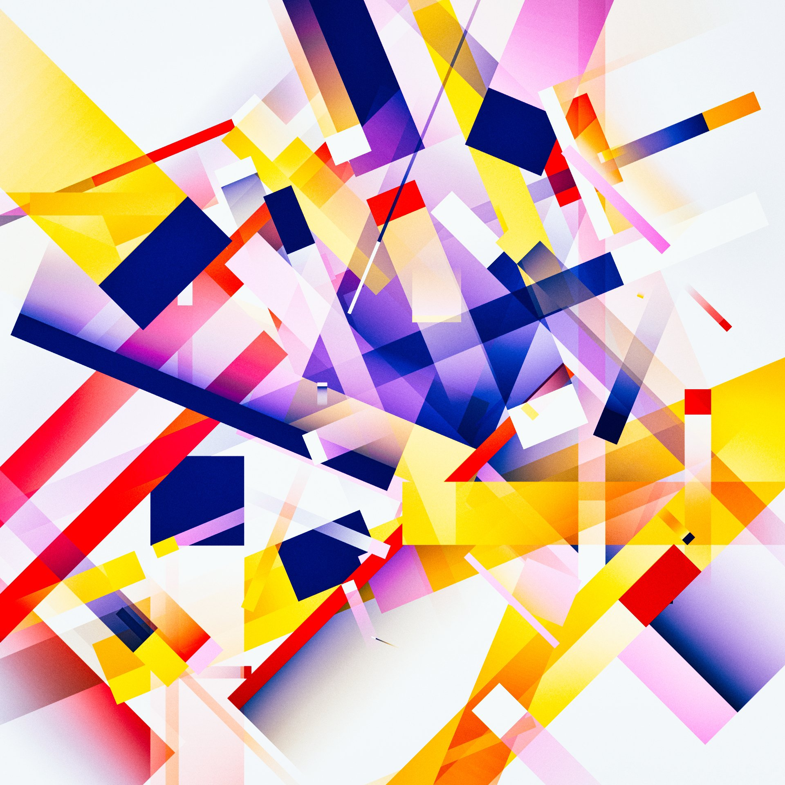
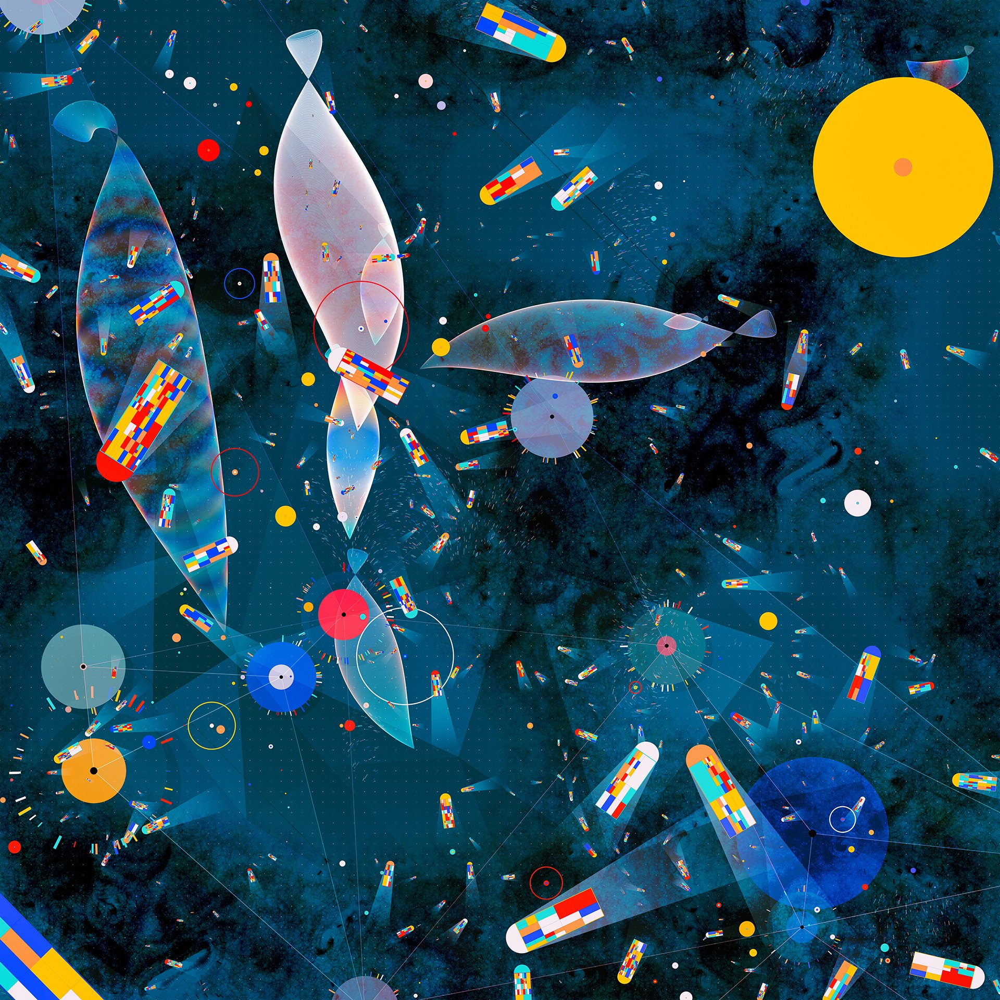
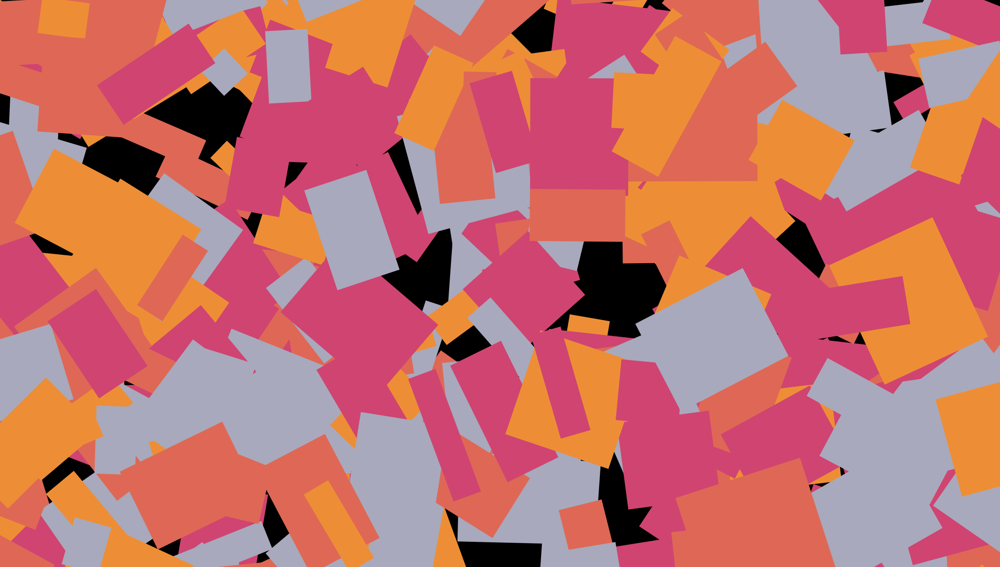

# Mini-Workshop 1: Generative art

There is a new generation of artists who use their software development skills to create art. For example, check out these ou by Manoloidee:

Your mission will be to create something in this vein, using Javascript and the DOM.

## Getting started

Create a new index.html, and link it up with a style.css and script.js. Add any global styles you want (a black background on the body might be nice!)

Create a new function, generateArt. For now, it won’t take any parameters.

## Exercise 1

Start by adding a div to the body, and give it an ID of `canvas`. It should span 100% of the available width / height.

In the JS, call our `generateArt` function right below its definition, so that it runs when the page loads.

This function should:

- Loop from 0 to 500
- Create a new div HTML element
- Give that element a random size, position, color, and rotation (transform: rotate)
  - For colors, I recommend browsing a website like Happy Hues or Adobe Color to find 5-6 complementary colors. For each div, you can select a random color from the list. Learn how to do this.
- Append that div to the body

You should wind up with something like this:

### Hints:

- Don’t forget units! For example, to calculate a random width, my code looks like: `elem.style.width = Math.random() * 100 + 20 + 'px';`
- For position, you can use absolute position with random top/left percentages.

## Exercise 2

You’ll notice that every time you refresh the page, you get a new piece of art. Let’s create a button we can click to regenerate the art, so we don’t have to keep refreshing.

- Add a button in the index.html. Give it an ID.
- In the JS, add an event listener. On click, it should run a new function, `cleanUp`.
- `cleanUp` should empty out the canvas div, to reset it to a blank canvas.
  -Inside the event listener, after calling `cleanUp`, call `generateArt` to regenerate the art.

You should get a new piece of art every time you click the button.

## Exercise 3

Let’s be a bit more creative with our properties! Add at least 3 new variables that are randomized for each shape. Some ideas:

- Background gradients instead of colors?
  - (Bonus points for using semi-transparent colors!)
- Opacity
- Border radius
- Contents (add random words inside each box?)
- Box shadow
- Mix blend modes (https://developer.mozilla.org/en-US/docs/Web/CSS/mix-blend-mode)

**Share what you make with the channel!**

## Exercise 4

A couple years ago, I created a tool for generating generative art: https://tinkersynth.com/

The neat thing about this tool is that you can tweak controls, and watch how it affects the art!

Let's do the same thing here, and add some controls so that users can interact with and tweak the art.

The `<input type="range">` tag can be used to give the user a slider. You can specify a `min` and `max`. Whenever the user changes the value, it emits a `change` event, which you can listen for.

Add a new div in the HTML, and give it an ID of `controls`. Using CSS, position it above the canvas (using `z-index`), and place it at the bottom of the screen.

Add several inputs to this div. One of them should be for the width of the boxes. Let’s say your boxes are currently between 20px and 120px wide; the input could have a range of 0-60, with Math.random adding another 20-60 (so there’s still a bit of randomness, but the user can change it so that the boxes are between 20-80px, or between 60-120px, for example)

Whenever the user interacts with the input, it should generate new art based on the new value of that parameter. You’ll need to add params to your generateArt function, and tie those values to the input (so when the user changes the input value, it updates a variable, and passes those variables to the function.

_Be creative!_ Try mapping controls to weird values. See what happens.

## Exercise 5

Consider this piece of generative art by Matt Deslauriers:

http://color-wander.surge.sh/

What's cool is that you can watch the art get created in front of your eyes!

Do something similar. Instead of generating 500 rectangles in a `for` loop, use `setInterval` to generate them 1 at a time, with a very short interval time (17 milliseconds)

You can also use a keyframe animation to fade each rectangle in, for a more fluid experience.

You could also use a keyframe animation to add an initial rotation animation! Be creative, experiment. Most beautiful generative art is the result of happy accidents / discoveries. It isn't usually preconceived.
